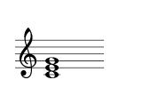
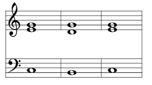
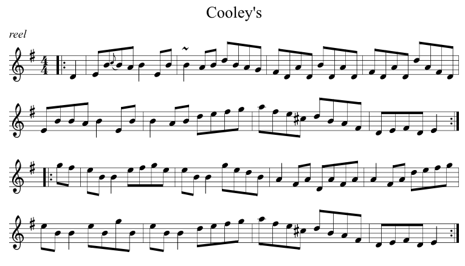

# abcR

[](https://www.tidyverse.org/lifecycle/#experimental)

This package provides utility functions for rendering music notation in
interactive R sessions. In RStudio, the rendered notation appears in the
Viewer pane. These functions are intended to help music researchers to
visualise music objects created during their programming tasks. The
current focus is on displaying chord sequences, but better support may
later be added for melodies. Music notation is rendered using the abcjs
package (<https://abcjs.net>), which was written by Paul Rosen and
Gregory Dyke, and released under the MIT license.

## Authors

  - *abcR*: Peter M. C. Harrison
  - *absjs*: Paul Rosen and Gregory Dyke

## License

Both *abcR* and *abcjs* are released under the MIT license.

## Installation

You can install *abcR* from Github by entering the following into your R
terminal:

``` r
if (!require(devtools)) install.packages("devtools")
devtools::install_github("pmcharrison/abcR")
```

## Example usage

Displaying a chord within RStudio:

``` r
library(abcR)
view_pi_chord(c(60, 64, 67))
```



Displaying a chord sequence (pitches are given in MIDI note numbers):

``` r
view_pi_chord_seq(list(c(48, 64, 67), c(47, 62, 67), c(48, 64, 67)))
```



Displaying a full *abc*
file:

``` r
view_abc_file(system.file("examples/example-song.abc", package = "abcR"))
```


